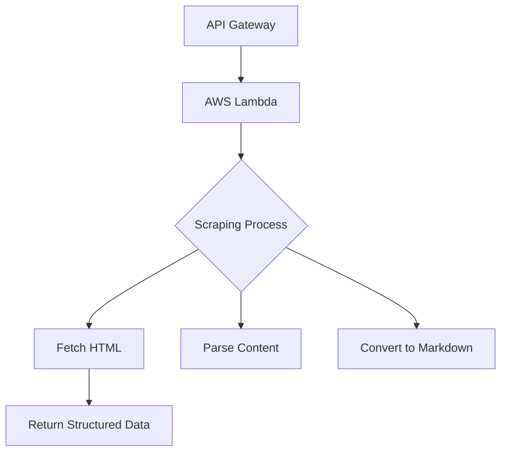

# Web Scraping Microservice - AWS Lambda 🌐✨

Welcome to the Web Scraping Microservice! This documentation provides a comprehensive guide for setting up, deploying, and maintaining the service on AWS Lambda. Enjoy the journey! 🚀

## Project Structure 🗂️
Below is the layout of the project:
```
lambda-services/scrape-service/
├── src/
│   └── scrape_lambda.py
├── requirements.txt
├── Dockerfile
├── build_and_deploy.sh
├── test/
│   └── test_scrape_lambda.py
└── README.md
```

## Prerequisites 🚀
Before getting started, ensure you have:
- AWS CLI configured with proper credentials 🔑
- Python 3.12 installed 🐍
- Docker installed (optional for container deployment) 🐳
- Node.js (for optional monitoring setup) ⚙️

## Configuration ⚙️
### Environment Variables 🌟
Set your environment variables appropriately:
```bash
# Required
export AWS_PROFILE="your-profile"  # AWS CLI profile
export AWS_REGION="us-east-1"      # AWS region

# Optional
export LAMBDA_FUNCTION="ScrapeService" # Default function name
export LOG_LEVEL="INFO"            # DEBUG/INFO/WARNING/ERROR
```

## Installation 🛠️
Follow these steps to install dependencies and configure AWS credentials:
```bash
# Install dependencies
pip install -r requirements.txt

# Configure AWS credentials
aws configure
```

## Deployment 🚀
Deploy your service to AWS Lambda using one of the methods below:

### Configuration ⚙️
Set these environment variables before deployment:

```bash
# Required
export AWS_PROFILE="your-aws-cli-profile"  # AWS credentials profile
export AWS_REGION="us-east-1"              # AWS region
export LAMBDA_FUNCTION="ScrapeService" # Lambda function name

# Optional
export LAMBDA_TIMEOUT=30      # Execution timeout in seconds
export LAMBDA_MEMORY_SIZE=512 # Memory allocation in MB
export LOG_LEVEL="INFO"       # Debugging: DEBUG/INFO/WARNING/ERROR
```

### ZIP Deployment 📦
1. **Edit deployment script**:
```bash
# Open the deployment script
nano build_and_deploy.sh

# Modify these lines (if needed):
SERVICE_NAME="scrape-service"
AWS_PROFILE="default"         # Change to your AWS profile
AWS_REGION="us-east-1"        # Update your region
LAMBDA_FUNCTION="ScrapeService" # Match Lambda console name
```

2. **Execute deployment**:
```bash
chmod +x build_and_deploy.sh
./build_and_deploy.sh
```

### Container Deployment 🐳
```bash
# Build with custom parameters
docker build \
  --build-arg AWS_REGION=$AWS_REGION \
  --build-arg LAMBDA_FUNCTION=$LAMBDA_FUNCTION \
  -t scrape-service .
```

### CI/CD Integration 🔄
Add these secrets to your CI/CD platform:
- `AWS_ACCESS_KEY_ID`
- `AWS_SECRET_ACCESS_KEY`
- `AWS_DEFAULT_REGION`

Example GitHub Actions workflow:
```yaml
- name: Deploy to Lambda
  env:
    AWS_PROFILE: ${{ secrets.AWS_PROFILE }}
    AWS_REGION: ${{ secrets.AWS_REGION }}
  run: |
    chmod +x build_and_deploy.sh
    ./build_and_deploy.sh
```

## Configuration Management ⚙️

### Environment Variables
| Variable          | Required | Default      | Description                |
|-------------------|----------|--------------|----------------------------|
| `AWS_PROFILE`     | No       | `default`    | AWS credentials profile    |
| `AWS_REGION`      | No       | `us-east-1`  | AWS service region          |
| `LAMBDA_FUNCTION` | No       | `ScrapeService` | Target Lambda function name |

### Deployment Options
**Temporary Configuration:**
```bash
# Single deployment with custom config
AWS_PROFILE="staging" AWS_REGION="eu-west-1" ./build_and_deploy.sh
```

**Persistent Configuration:**
```bash
# Add to shell profile (~/.bashrc or ~/.zshrc)
export AWS_PROFILE="production"
export AWS_REGION="sa-east-1"
```

## Testing ✅
Ensure your microservice works as expected:

### Unit Tests 🔍
Run the unit tests:
```bash
pytest test/ -v
```

### Integration Tests 🔗
Test the integration with a sample URL:
```bash
# Test with sample URL
python -m pytest test/integration/test_scrape_integration.py
```

## API Usage 🌐
Access the Scrape API through the following endpoint:
**Endpoint:**  
`POST https://{api-id}.execute-api.{region}.amazonaws.com/scrape`

**Request:**
```bash
curl -X POST https://api.example.com/scrape \
  -H "Content-Type: application/json" \
  -H "x-api-key: YOUR_API_KEY" \
  -d '{"url": "https://example.com"}'
```

**Response:**
```json
{
  "markdown": "# Example Domain...",
  "images": [
    "https://example.com/image1.jpg",
    "https://example.com/image2.jpg"
  ],
  "metadata": {
    "processing_time": "1.23s",
    "content_size": "45KB"
  }
}
```

## Monitoring & Logging 📊
Monitor your AWS Lambda logs using CloudWatch:
```bash
# Create CloudWatch log group
aws logs create-log-group --log-group-name /aws/lambda/ScrapeService

# View real-time logs
aws logs tail /aws/lambda/ScrapeService --follow
```

## Security 🔒
Key security practices include:
- **HTTPS Enforcement:** Enabled at API Gateway 🛡️
- **Rate Limiting:** 100 requests/second ⏱️
- **Authentication:** API Key required 🔑
- **IAM Policies:** Least privilege access 🔐
- **Secret Rotation:** Quarterly key rotation 🔄

## Cost Optimization 💰
Optimize your AWS deployment by:
- Enabling Lambda Provisioned Concurrency for steady traffic ⚙️
- Utilizing CloudFront caching for frequent requests 📦
- Setting appropriate memory size (512MB recommended) ⚖️
- Activating API Gateway caching 🚀

## Troubleshooting 🛠️
Common issues and remedies:
1. **Timeout Errors ⏰**  
   Increase Lambda timeout (max 15 minutes)
2. **Missing Dependencies ⚠️**  
   Run `pip install -r requirements.txt`
3. **Permission Denied 🚫**  
   Verify IAM roles include:
   - AWSLambdaBasicExecutionRole
   - AmazonAPIGatewayInvokeFullAccess
4. **Invalid URL Format 🌐**  
   Ensure URLs include the protocol (http:// or https://)

## CI/CD Pipeline 🤖
Automate your deployments with GitHub Actions. Example workflow (`.github/workflows/deploy.yml`):
```yaml
name: Deploy
on:
  push:
    branches: [ main ]
jobs:
  deploy:
    runs-on: ubuntu-latest
    steps:
      - uses: actions/checkout@v4
      - uses: actions/setup-python@v4
        with:
          python-version: '3.12'
      - run: pip install -r requirements.txt
      - run: chmod +x build_and_deploy.sh
      - run: ./build_and_deploy.sh
        env:
          AWS_ACCESS_KEY_ID: ${{ secrets.AWS_ACCESS_KEY_ID }}
          AWS_SECRET_ACCESS_KEY: ${{ secrets.AWS_SECRET_ACCESS_KEY }}
          AWS_REGION: 'us-east-1'
```

## Maintenance 🔧
Keep your service up-to-date and optimized:

**Dependency Updates:**
```bash
# Update all packages
pip list --outdated
pip freeze > requirements.txt
```

**Scheduled Cleanup:**
```bash
# Remove old Lambda versions
aws lambda list-versions-by-function --function-name ScrapeService
aws lambda delete-function --function-name ScrapeService --qualifier <version>
```

## Architecture


## Monitoring
```bash
# View logs
aws logs tail /aws/lambda/$LAMBDA_FUNCTION \
  --region $AWS_REGION \
  --profile $AWS_PROFILE
```

[Back to Main README](../README.md)
